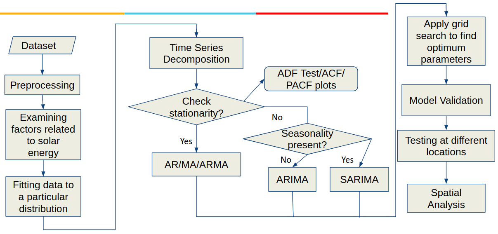
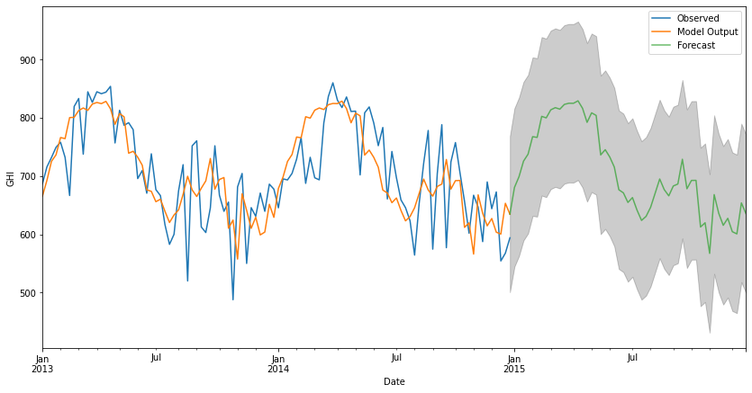

# Statistical-Analysis-and-Forecasting-of-Solar-Energy

This repository contains the project "Statistical Analysis and Forecasting of Solar Energy - Inter States" completed in the partial fulfillment of the course Applied Statistical Methods.

## Project Objectives

The aim of the project is to analyse solar energy in 4 different states and to train an appropriate time series model for solar energy forecasting.

## Methodology :

    

## Time Series Model Validation :

This is forecasting obtained from SARIMA (1,1,1)(1,1,1,52) with a 95% confidence interval.

## Analysis on different states :

This tables shows the different error rates for the SARIMA model for each of the 4 locations.

#### For more details about the methodology and results, refer to the [project report](ASM-Assignment-2.pdf)
